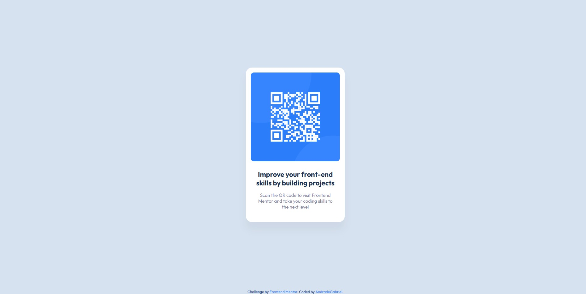

# Frontend Mentor | QR code component
 
## ✨ Overview

### 🖼️ Project Screenshot

### 🔗 Project Links
Solution: [Open](https://www.frontendmentor.io/solutions/responsividade-criada-usando-max-width-DHPMAIXU9c)
Live Site: [Open](https://deluxe-twilight-7a2724.netlify.app/)

### ✍ My Process

This project is a responsive QR Code component, created as part of a Frontend Mentor challenge. The goal was to replicate a given design while ensuring accessibility and good coding practices.
Technologies & Techniques Used:

- **HTML5:** Semantic structure with `<main>`, `<section>`, and `<footer>` elements.
- **CSS3:** Layout styling with Flexbox, custom typography using Google Fonts, and shadow effects for a modern look.
- **Accessibility Enhancements:** ARIA attributes (`role="region"`, `aria-labelledby`) for screen readers, meaningful alt text, and structured content for better usability.
- **Responsive Design:** Ensured adaptability across different screen sizes using viewport settings and flexible units.
- **Different Measurement Units:** Used a mix of px (fixed sizes) and rem (relative sizes) for better scalability and accessibility.

This project helped improve CSS layout skills, semantic HTML usage, and accessibility best practices. 🚀

## 👨‍💻 Autor

Gabriel Andrade  
[GitHub](https://github.com/4ndradeGabriel)  
[LinkedIn](https://www.linkedin.com/in/andradegabrielw)  

---

Desenvolvido por [Gabriel Andrade](https://github.com/4ndradeGabriel)